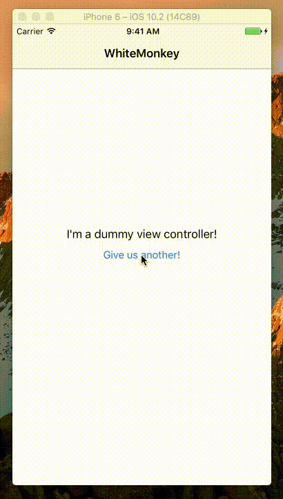

#JCBreadCrumbBackButton


###An easy way to replace the standard Back UIBarButton with a breadcrumb-style history view.

*Built by Joe Crozier - [www.joecrozier.ca](www.joecrozier.ca)*




###Installation

Dead-simple. Just clone the repo and include the contents of `/JCBreadCrumb`. 

On any navigation-based view controller, simply add the lines -

```
        JCBreadCrumbBarButtonItem *breadCrumbBarButton = [[JCBreadCrumbBarButtonItem alloc] initBreadCrumbBarButtonItem];
        breadCrumbBarButton.parentController = self;
        self.navigationItem.hidesBackButton = YES;
        self.navigationItem.leftBarButtonItems = @[breadCrumbBarButton];   
```

JCBreadCrumbBackButton uses a custom sprite for the back button, as Apple doesn't allow access to the default back button. Just grab the BackButton asset from Assets.xcassets, or use your own.

###Usage

Long-press will bring up the breadcrumb menu. It will auto-size the width to that of the widest title in the view controller stack.

Short-press functions as usual, popping off the current view controller from the stack.

###TO-DO

- Add to CocoaPods
- Allow for custom frame for breadcrumb menu
- Add stylization options
- Better gif.